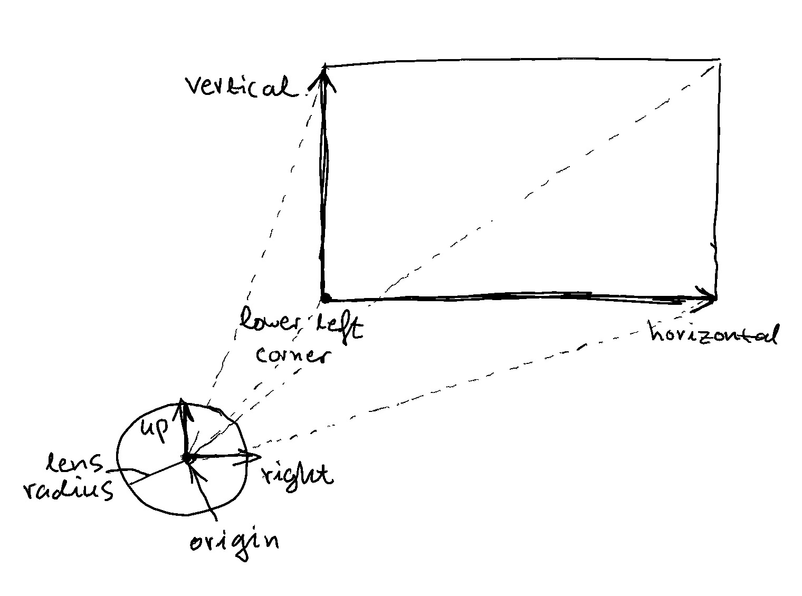

# `Camera` coordinate system

The `Camera` class contains a coordinate system that can be used to generate rays using the thin-lens approximation for depth of field effects. Note: `right`, `up` are just normalized `horizontal`, `vertical` vectors.



```rust
// A WGSL shader example of how to generate a ray using `Camera`.
fn generateCameraRay(camera: Camera, rngState: ptr<function, u32>, u: f32, v: f32) -> Ray {
    let randomPointInAperture = camera.lensRadius * randomVec3InUnitDisk(rngState);
    let lensOffset = randomPointInAperture.x * camera.right + randomPointInAperture.y * camera.up;

    let origin = camera.origin + lensOffset;
    let direction = camera.lowerLeftCorner + u * camera.horizontal + v * camera.vertical - origin;

    return Ray(origin, direction);
}
```
